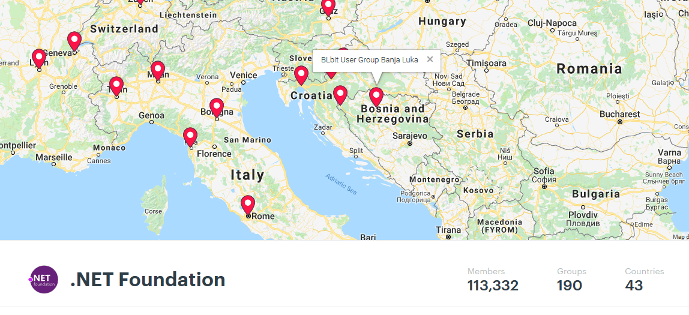

# BLbit novosti
### 4. avgust 2018 

---

## Novosti: .NET ekosistem

- .NET Core 2.2 / [ASP.NET Core 2.2](https://github.com/aspnet/Announcements/issues/307)
  - OpenAPI poboljšanja
  - HTTP API REPL alat
  - Authorization server
  - Ažurirani templates – Bootstrap 4
- .NET Core 3.0 najavljen
  - [Podrška za Windows desktop aplikacije](https://blogs.msdn.microsoft.com/dotnet/2018/05/07/net-core-3-and-support-for-windows-desktop-applications/)
- [Span<T>](https://msdn.microsoft.com/en-us/magazine/mt814808.aspx) dolazi u [narednoj verziji](https://github.com/dotnet/standard/tree/master/docs/planning/netstandard-vnext) .NET Standarda
- Blazor – [nove verzije](https://blogs.msdn.microsoft.com/webdev/2018/07/25/blazor-0-5-0-experimental-release-now-available/)
- [ML.NET](https://www.microsoft.com/net/learn/apps/machine-learning-and-ai/ml-dotnet)

---

## Novosti: Web i ostalo

- Chrome HTTP – Not Secure, od 24. jula
  - [Zvanična objava na Google blogu](https://security.googleblog.com/2018/02/a-secure-web-is-here-to-stay.html)
  - [HackerNews članak](https://thehackernews.com/2018/07/google-chrome-not-secure.html), pojašnjenje zašto HTTPS

---

## Community: Konferencije

- KulenDayz 31.08. - 02.09., Osijek Hrvatska - http://www.kulendayz.com/
- .NET Conf, 12.09. – 14.09., online - https://www.dotnetconf.net/ 
- MSCommunity, 14.09., Sarajevo BiH – https://conference.mscommunity.ba/ 
- CrisCon, 22.09., Križevci Hrvatska - http://criscon.krizevci.hr/ 

---

## Community: BLbit

---

## Community: BLbit

- BLbit korisnička grupa je dio .NET Foundation-a! - https://www.meetup.com/pro/dotnet/ 
- Organizujemo zajedničko gledanje .NET Conf keynote-a :)
- Naredni meetup u septembru/oktobru, kao dio .NET Conf-a

---

## Današnja predavanja

